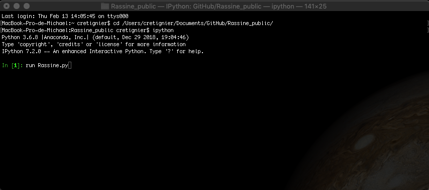

Tutorial
~~~~~~~~

Basic command
=============

This tutorial is to help you to use efficiently RASSINE. First check
that you possess all the needed dependencies by running the test files
Sect. `1.1 <#individual>`__ and Sect. `1.2 <#timeseries>`__. Excepted
pandas, all the libraries are quite common if you are a familiar python
user.

You can familiarise with the code by reading, the **README.txt** file,
the docstring on the parameters (**Docstring_rassine.pdf**) as well as
the main article.

.. _individual:

Individual spectra normalisation
--------------------------------

Open a terminal and move into the Rassine_public directory containing
the main codes and launch an Ipython session :

::

   cd /Users/cretignier/Documents/GitHub/Rassine_public/
   ipython 
   run Rassine.py 

|image|

If all the dependencies are installed the first graphical interface
should appear. In this window the slider should work and your smoothed
spectra should react in real time. Just follow the steps and communicate
with the Sphinx in the terminal. If you managed to reach the end of the
code, it means that you are now able to normalise spectra by changing
the input spectrum file. But before that, let us rerun the test file
without the Sphinx. To do so, you can just disable it by switching off
the feedback button in the config file **Rassine_config.py**.

::

   feedback = False        # run the code without graphical feedback and interactions with the sphinx (only wishable if lot of spectra)     

And in the previous terminal :

::

    run Rassine.py 

By doing so, you are now configured in "complete automatic mode". You
can basically measure the typical time to reduce one spectra in
automatic mode depending on your computer performance. Keep in mind that
this mode will not necessarily provide you the best result but is giving
most of the time good first guess values for the parameter. The only
parameters that are not automatic are the smoothing kernel and kernel
length as well as the penalty law.

::

      par_smoothing_box = 6           # half-window of the box used to smooth (1 => no smoothing, 'auto' available)  <--- PARAMETER 2
      par_reg_nu = 'poly_1.0'    # penality-radius law          <--- PARAMETER 6

Remark you can also switch on the smoothing in automatic mode by putting
the ’auto’ keyword, but usually the Savitchy-Golay filtering works in a
quite large diversity of cases (excepted for SNR spectra lower than
:math:`\sim75`):

::

   par_smoothing_box = 'auto'           # half-window of the box used to smooth (1 => no smoothing, 'auto' available)  <--- PARAMETER 2
   par_smoothing_kernel = 'erf' # 'rectangular','gaussian','savgol' if a value is specified in smoothig_kernel

.. _timeseries:

Spectra time-series
-------------------

RASSINE also offers an unique opportunity to normalise a spectra
time-series (a series of spectra all coming from the same star). To do
so, moves into the main directory, and launch the test file in an
Ipython shell by running **Rassine_trigger.py**.

::

   cd /Users/cretignier/Documents/GitHub/Rassine_public/
   ipython 
   run Rassine_trigger.py 

Hear that voice ? It is Victoria. She’s there to warn you either when
the Sphinx is waiting on your feedback or when a reduction step is
finished. A problem with Victoria ? That’s fine, you can select Daniel
instead ! Bored by human voices ? You can also disable them in the
**Rassine_functions.py** file.

::

   voice_name = ['Victoria', 'Daniel', None][0] #voice pitch of the auditive feedback

You can select the steps of the cascade that you want by switching
on/off the buttons in the **Rassine_trigger.py**.

::

   preprocessed = 1
   match_frame = 1
   stacking = 1
   rassine_normalisation_master = 1
   rassine_normalisation = 1
   rassine_intersect_continuum = 1
   rassine_diff_continuum = 1

Spectra of different stars
==========================

RASSINE can reduce spectra of different stars, but if so you will have
to use the full automatic mode. First put all your spectra in a common
directory and change the directory name of the **Rassine_trigger.py**
file as well as the instrument for the preprocessing in case of fits
files. All your spectra should come from the same instrument.

::

   instrument = 'HARPS'                                                     # instrument (either HARPS, HARPN, CORALIE or ESPRESSO for the moment)
   dir_spec_timeseries = cwd+'/spectra_library/CenB/'   # directory containing the s1d spectra timeseries

Because all the spectra are now independent and do not share any
information, you only have to preprocess them and to launch the Rassine
normalisation in multiprocess:

::

   preprocessed = 1
   match_frame = 0
   stacking = 0
   rassine_normalisation_master = 0
   rassine_normalisation = 1
   rassine_intersect_continuum = 0
   rassine_diff_continuum = 0

Change the input spectrum of individual reduction
=================================================

You are now ready to normalise your own spectra (I am crossing the
fingers for you). To do so, change the input spectrum name in the
**Rassine_config.py** file and switch on/off the feedback depending on
your wish.

::

   spectrum_name = cwd+'/spectra_library/spectrum_cenB.csv' # full path of your spectrum pickle/csv file
   feedback = False        # run the code without graphical feedback and interactions with the sphinx (only wishable if lot of spectra)     

As a reminder, RASSINE was developed for 1d spectra, if you are trying
to normalise a 2d spectrum, consider to switch on the feedbacks and keep
an eye on the automatic value selected.

Change the input spectra of time-series
=======================================

In a similar fashion that for individual spectra, change the input
spectra directory in the **Rassine_trigger.py** file. Indicate the
instrument that will be used to preprocess your data in case of fits
file and launch the **Rassine_trigger.py** code.

::

   instrument = 'HARPS'                                                     # instrument (either HARPS, HARPN, CORALIE or ESPRESSO for the moment)
   dir_spec_timeseries = cwd+'/spectra_library/CenB/'   # directory containing the s1d spectra timeseries
    

